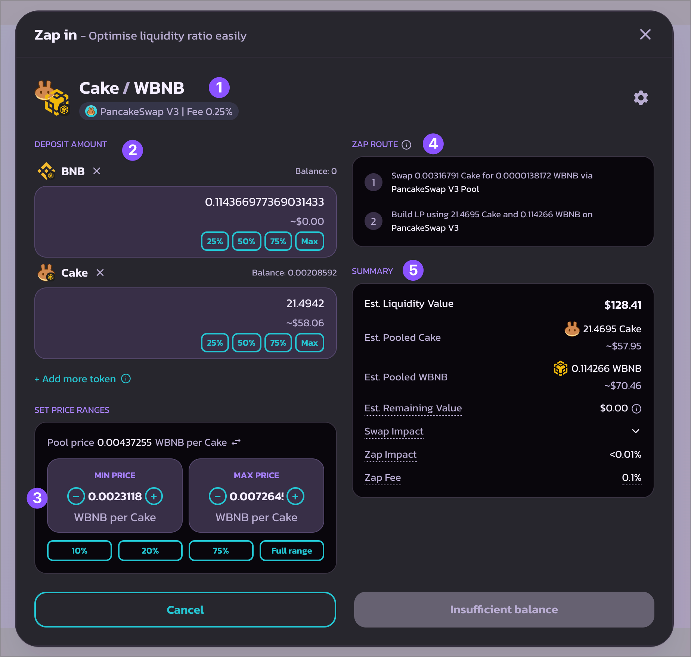

# 如何使用农场

农场的流动性质押功能，是用户在 PancakeSwap 上获得 CAKE 奖励的一大途径。&#x20;

与质押在糖浆池不同，使用农场需要你先提供一个代币对（**由两个代币组成**）的流动性以获得流动性仓位NFT 或者是 LP 代币（LP token），然后你将其质押在农场以获得奖励。 这使你可以在赚取 CAKE 的同时仍持有原有的两种代币，并且赚取 LP 奖励。


农场与糖浆池相比，奖励更高，但同时它们拥有**无常损失**带来的风险。它并没有听起来那么可怕，但在开始种植前，适当的去了解它是值得的。

查看这一篇来自币安的， [关于无常损失的文章](https://academy.binance.com/en/articles/impermanent-loss-explained) 来了解更多。


## **找到想要提供流动性的币对**

<figure><figcaption></figcaption></figure>

现在，有了通用农场页面（Universal Farm Page），你可以通过筛选代币找到流动性对，查看它们在所有 PancakeSwap 支持的区块链中的手续费情况 、交易量和 APR，而无需在钱包中切换网络。&#x20;

前往： [https://pancakeswap.finance/liquidity/pools](https://pancakeswap.finance/liquidity/pools) 开始

**功能细分**

<figure><figcaption></figcaption></figure>

* 所有当下流行的或附有 PancakeSwap 农场的流动性池/交易对。
* 您所有的流动性仓位。
* 所有的旧版农场。如果您在“所有池”中找不到之前质押的农场，请尝试在这里搜索。
* 默认情况下，该页面显示所有支持的链上的农场和代币。使用此下拉菜单按网络/链筛选流动性池。
* 使用此下拉菜单按代币筛选流动性池。
* 使用此选项卡按 DEX 类型筛选流动性池。
* 点击 APR、TVL 或 24 小时交易量的箭头按钮，按所选指标对流动性池进行排序。
* bCAKE 专区 - 农场收益助推器。点此[了解更多](../../../products/yield-farming/bcake/)。
* 如果您在使用新版本时遇到任何问题，请使用[此链接](https://pancakeswap.finance/farms)返回旧版农场页面。

**提供流动性**

<figure><figcaption></figcaption></figure>

找到可提供流动性的配对后，点击进入详细页面，查看更多信息，如&#x20;

* TVL&#x20;
* 交易量&#x20;
* 手续费情况&#x20;
* APR&#x20;
* 您的现有流动性仓位

要创建 LP，请单击 “Add Liquidity +”（添加流动性 +），并按照此处的说明操作：


[tian-jia-yi-chu-liu-dong-xing.md](../../pancakeswap-exchange/tian-jia-yi-chu-liu-dong-xing.md)


## **质押流动性仓位进行农场挖矿**

<figure><figcaption></figcaption></figure>

一旦添加了流动资金，它们就会出现在右上角的表格中。或在 “我的持仓 ”选项卡中。&#x20;

* 对于 V3，只需点击 “Stake（质押）”即可质押，开始赚取 CAKE。由于 V3 用户可以创建多个仓位，您可以重复上述步骤，在不同的价格范围建立多个仓位。&#x20;
* 对于 V2 和 StableSwap，点击 “Stake（质押） ”后，您需要指定要质押的 LP 代币数量。在大多数情况下，您应质押 100%  LP 代币，以获得最大收益。

## **收割农场奖励**

<figure><figcaption></figcaption></figure>

在新的通用农场页面，查找您所有的持仓从未如此简单。只需前往“我的持仓”页面，并点击右上角的“仅农场”按钮。所有的质押仓位都会被过滤出来，无论您选择的是哪个网络。\

与流动性池/交易对列表类似，您可以使用工具栏按网络/链、代币和 DEX 类型来筛选仓位。\

要从已质押的仓位中收获 CAKE 奖励，只需点击“Harvest （收割）”并在钱包弹窗中确认即可。\

如果您有多个质押仓位，您需要分别收割奖励。

## **质押在农场中的仓位进行添加或移除流动性**

在 V3 中，质押在农场时，您仍然可以添加或移除流动性，而无需取消质押。\
要进行此操作，只需返回到“我的持仓”页面，找到您想要调整的仓位。

<figure><figcaption></figcaption></figure>

点击包含代币对和仓位 ID 的仓位标题，打开仓位详情页面。\
只需使用“添加”或“移除”按钮来调整质押仓位中的流动性。

<figure><figcaption></figcaption></figure>

## **取消质押**

您可以随时取消质押流动性仓位。

<figure><figcaption></figcaption></figure>

要取消质押，只需返回 “我的持仓”，找到该对应流动性仓位：

* （针对 V3 仓位）点击“unstake 取消质押 ”&#x20;
* （对于 V2、StableSwap LPs）点击 “-”然后选择要取消质押的金额&#x20;

然后在钱包弹出的提示中确认。短暂等待后，您的仓位 NFT 或 LP 代币将连同所有待定的 CAKE 奖励一起返回您的钱包。

## 我应该多久收割一次我的奖励？

你多久收割一次奖励取决于你，但请记住，收割时需要支付少量 gas 费用。&#x20;

点击 **收割** 后，确认时，你可以在钱包中看到此费用。

<figure><figcaption></figcaption></figure>

以上显示了 MetaMask 钱包中出现的收割费用。不同的钱包会以不同的方式显示信息。可以考虑让你的奖励累积一段时间，这样你支付 gas 费用的频率就会降低。&#x20;

**快乐耕种吧！**
