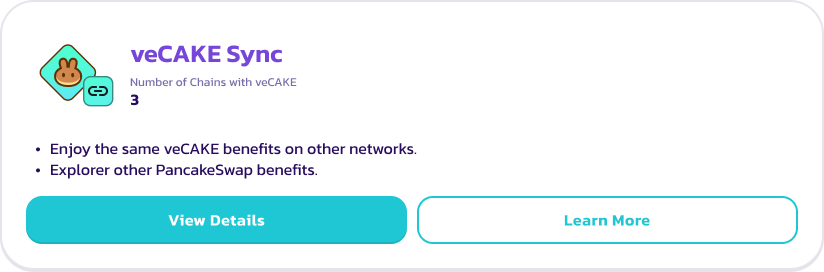

# Zap

### What is Zap 

Zap is a feature that allows you to add liquidity with ease. With Zap, you can provide V3 liquidity with only one of the tokens from the liquidity pool. Simply set the price range, choose the amount to provide, and execute. Your tokens will be automatically balanced to form the liquidity position while being traded in the most efficient way, with the lowest price impact and slippage.

### How to Use 

#### Before 

For now, Zap only supports:

* 🆕 Any token!
* Using single token
* 🆕 Using duo tokens
* 🆕 Or... using multiple tokens (yes it's can be used like dust collector)
* And on BNB Chain (more network is coming)

#### Start 

<figure><figcaption></figcaption></figure>

To use Zap, simply go to Add V3 Liquidity page, select the trading pair you want to provide liquidity to, fee tier, and the price range.

Then select the token amount you want to provide liquidity to.

Option to Zap will automatically appear when one or more tokens are short on balance.

Click the link to bring up the V3 Zap modal.

#### Initiate Zap 

<figure><figcaption></figcaption></figure>

Within the new “Zap in” modal. You may find the following fields:

1. The trading pair you are Zapping (providing liquidity) to.
2. The deposit token(s) and the amount(s) to deposit. You may freely add in or remove any tokens for the Zap.
3. The price range of the new position. You may also click the arrows to flip between different price displays.
4. A detailed breakdown of how the Zap feature will handle your deposit tokens.
5. A summary of the stats including:
   1. Estimated value in USD for the new liquidity position.
   2. Estimate token amount in the new liquidity position.
   3. Estimated leftover funds in USD after Zapping. In most cases it should be 0. If the liquidity pool or the tokens have very little liquidity, this value may increase.
   4. The price impact for the token swaps and rebalances while Zapping.
   5. The price impact for the liquidity adding and position building.
   6. Zap fee. Depending on the liquidity pair, fee rate may vary.


Note that you may need to reconfigure the amount to Zap based on your available balance. If you don't have balance on one of the tokens, please remove them.



You may notice that the settings from “Add V3 Liquidity” are automatically carried to the Zap modal. Including the deposit amount and price range settings.


#### Start Zapping 

<figure><figcaption></figcaption></figure>

Finally click “Approve” and confirm in the wallet popup for token allowance.

Then, click “Preview” to bring up the final confirmation modal. Before proceeding, please kindly review all the stats and estimates shown in the final confirmations modal. Especially the impact figures and max slippage.

Finally, click “Add Liquidity” and confirm in your wallet popup.

After the tx is confirmed, you shall see your shiny new position in “My Position” page

<figure><figcaption></figcaption></figure>

#### More Settings 

<figure><figcaption></figcaption></figure>

If you want to further customise your Zap experience. Simply click the gear icon in top right hand corner. In the settings, you may configure:

* The max slippage while zapping.
* The timeline on the transaction deadline.
* Whether to use KyberSwap’s aggregated liquidity to perform token rebalance. Toggle this off if you only want to trade in PancakeSwap Pools.
* Degen mode can be used to perform super high slippage Zaps. Not recommended for normal use cases, use it at your own risk.


Please note that the Slippage and Deadline settings are independent to the Swap and Liquidity page.


#### Zap in using duo tokens

<figure><figcaption></figcaption></figure>

Now you may Zap in your liquidity with duo tokens. This is useful when your available balance is not matching with the price settings, and the required token amount and ratio it is calling for. Simply Zap, and the ratio will be automatically rebalanced.

#### Zap in using many tokens

<figure><figcaption></figcaption></figure>

Yes it works just like a dust token collector. It is suitable for cleaning up small balances in your wallet, and put them into a position to start earning from trading fees.&#x20;

