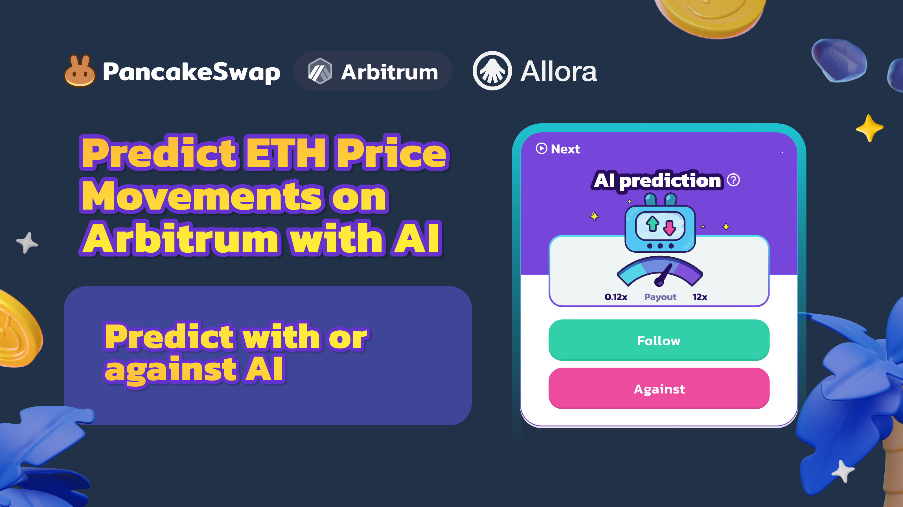

# AI Prediction

<figure><figcaption></figcaption></figure>

### What is PancakeSwap AI prediction?

PancakeSwap will use the Allora Network’s AI price predictions to create a new AI-powered prediction market. In PancakeSwap’s current prediction market, users predict whether the price of ETH will rise or fall within a 20-minute window. If a user's prediction is correct, they win; if it's incorrect, they lose.

In this new addition to the prediction market using Allora’s AI price predictions, users will predict the future price of ETH with or against AI. This next phase introduces a novel AI-powered dynamic to the platform’s popular prediction market. By integrating Allora’s ML-powered collective intelligence network, PancakeSwap can offer an engaging user experience at the forefront of DeFi's AI development.

### Rules for AI-powered Prediction:

AI-prediction works similar to regular prediction on BNB change, with little twists and differences:

1. Rounds are 20 minutes - 10 minutes for users to place bets, 10 minutes for the round to settle against market price.
2. Users can bid during the first 10 minutes with the options "Follow" or "Against", referring to betting with or against AI. At this time, AI has not locked a position or price.
3. Once round bets are closed, the AI will generate a price prediction that is higher or lower than the current locked price. AI will be positioned "higher" or "lower" than the current price.
4. After 10 minutes, the round is resolved and the AI either wins or loses. Users are paid out accordingly.

### **How to use AI-powered Prediction :**

1\. Go to [PancakeSwap Prediction](https://pancakeswap.finance/prediction?token=ETH\&chain=arb) on Arbitrum

2\. Select the prediction round you want to participate in and make your prediction based on either the AI's forecast or going against it.

* On the interface, you can align with the AI's forecast by selecting "Follow" or go "Against" the AI by not following it. Please note that you will only see whether the AI predicts the price to rise or fall after placing your bet. Both "Follow" and "Against" bets will be placed by users, meaning the AI will not predict against any user. Instead, users choose to either trust the AI or go against it based on their judgment.
* Example: Let's say the current ETH price is $3,500. If the AI forecast predicts the ETH price will rise/fall in the next 10 minutes, and you want to follow the AI's prediction, select "Follow" to align with the AI's prediction. On the other hand, if you think the AI may be wrong, click "Against" to go against the AI's prediction. Please note that you can only see whether AI is betting up or down after you place the bet!

Disclaimer and Risk Warning: The AI prediction is powered by Allora, and after initial testing, the accuracy is 65%. This means the AI can predict correctly or incorrectly, users should exercise caution and make informed decisions when choosing to follow or go against the AI's predictions.. This content is for general information and educational purposes only, without representation or warranty. It should not be construed as financial, legal, or other professional advice, nor intended to recommend purchasing any specific product or service. You should seek advice from appropriate professional advisors.

<figure><figcaption></figcaption></figure>

3\. Place your prediction by entering the amount you wish to predict (minimum is 0.00001 ETH), confirming your transaction, and signing it in your wallet.

4\. Wait for the Round to Close: Watch the result after 10 minutes.

* For example, if the current ETH price was $3,500 and you followed the AI prediction that it would rise in the next 10 minutes, and the price increases to $3,505, your prediction was correct, and you win a share of the round's prize pool. Conversely, if the price falls to $3,498, you would lose for making the wrong prediction.

<figure><figcaption></figcaption></figure>

5\. Collect Your Winnings: If your prediction is correct once the round ends, collect your winnings! You can also view the history of previous rounds in the "history section".

Please note that the payout multiplier for each round will vary based on the bets placed by users on each side.

Supported Tokens: ETH

Fees: 3% of each round's total pot to the treasury, with a portion of the fees used for buyback and burn. The remaining fees will be used in the treasury for future marketing and development.

### &#x20;How do I check the AI's performance?

You can refer to the Round History on the history tab to check the previous round price and AI decision. All rounds are settled on-chain; refer to the [prediction contract](https://arbiscan.io/address/0x1cdc19B13729f16C5284a0ACE825F83fC9d799f4) for more information.

<figure><figcaption>
Refer to history tab on the right
</figcaption></figure>

<figure><figcaption></figcaption></figure>

